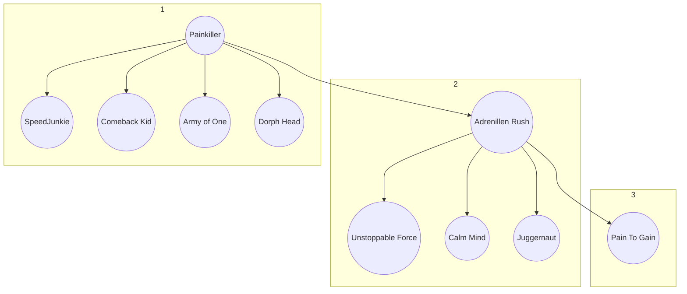

---
{"dg-publish":true,"permalink":"/cyberpunk-one-shot/perk-trees/"}
---

## Body Perk Tree

| Perk         | Description                                                                                                                                                                              | Perk Point Cost | Unlock Requirement      |
| ------------ | ---------------------------------------------------------------------------------------------------------------------------------------------------------------------------------------- | --------------- | ----------------------- |
| Painkiller   |                                                                                                                                                                                          |                 |                         |
| Painkiller   | Unlocks slow Health Regen in combat.                                                                                                                                                     | 1               | Rookie Level            |
| Speed Junkie | +60% Health Regen Rate                                                                                                                                                                   | 1               | Level 1 Painkiller Perk |
| Comeback Kid | +1% Health Regen Rate for each percent of missing health.                                                                                                                                | 1               | Level 1 Painkiller Perk |
| Army of One  | +10% Health Regen Rate for each nearby enemy.                                                                                                                                            | 1               | Level 1 Painkiller Perk |
| Fury Road    |                                                                                                                                                                                          |                 |                         |
| Fury Road    | In vehicle collisions:  - +50% damage to every enemy vehicle and their occupants. - -50% damage to your vehicle.  You take no damage as a vehicle occupant in collisions. | 1               | Rookie Level            |

| Perk               | Description                                                                                                                                                                                                   | Perk Point Cost | Restrictions                          | Unlock Requirement         |
| ------------------ | ------------------------------------------------------------------------------------------------------------------------------------------------------------------------------------------------------------- | --------------- | ------------------------------------- | -------------------------- |
| Wrecking Ball      |                                                                                                                                                                                                               |                 |                                       |                            |
| Wrecking Ball      | - Level 1: -15% Stamina cost for attacks with Blunt Weapons. - Level 2: Allows you to barrel into enemies while sprinting and blocking with Blunt Weapons, causing damage and a chance to knock them down. | 2               | Only affects Blunt Weapons            | Pro Level                  |
| Clapback           | - +100% knockdown chance with Defensive Attacks. Cooldown: 10 seconds. - +100% Stun chance with Counterattacks.                                                                                            | 1               | Only affects Blunt Weapons            | Level 2 Wrecking Ball Perk |
| Fly Swatter        | - -40% incoming ranged damage when blocking with Blunt Weapons.                                                                                                                                               | 1               | Only affects Blunt Weapons            | Level 2 Wrecking Ball Perk |
| Breakthrough       | - -40% enemy Armor for 7 seconds after hitting them with a Strong Attack.                                                                                                                                     | 1               | Only affects Blunt Weapons            | Level 2 Wrecking Ball Perk |
| Kinetic Absorption | - Blocking an attack gives:     - +10% Stamina     - +30% damage with Blunt Weapons for 5 seconds.                                                                                                      | 1               | Only affects Blunt Weapons            | Level 2 Wrecking Ball Perk |
| Die! Die! Die!     |                                                                                                                                                                                                               |                 |                                       |                            |
| Die! Die! Die!     | - Level 1: +12.5% Crit Chance at low Stamina. - Level 2: Increased fire rate as Stamina decreases (max. +25% at 0 Stamina). Bonus to weapon handling as Stamina decreases.                                 | 2               | Only affects Shotguns, LMGs, and HMGs | Pro Level                  |
| Like a Feather     | No movement speed penalty with Shotguns, Light Machine Guns, and Heavy Machine Guns.                                                                                                                          | 1               | Level 2 Die! Die! Die! Perk           |                            |
| Don't Stop Me Now  | When below 33% Stamina:  - +15% Mitigation Chance - +5% Mitigation Strength                                                                                                                          | 1               | Level 2 Die! Die! Die! Perk           |                            |
| Bullet Ballet      | -25% bullet spread when moving.                                                                                                                                                                               | 1               | Level 2 Die! Die! Die! Perk           |                            |